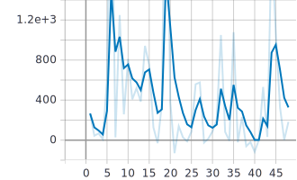
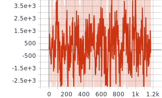

# reinforcement_trading
Environment and models for reinforcement learning applied to trading synthetic signals with statistical autocorrelations or trends.

Fractional Brownian motion (fBM) is a variant of standard Brownian motion that replaces the independant Gaussian increments with correlated noise.

The amount of autorcorrelation is controlled by a parameter H called the Hurst exponent. H=0.5 corresponds to the standard Brownian motion, with no statistical correlation between increments; in a trading context, we would say there is no stattiscal arbitrage opportunity. H<0.5 corresponds to negative autocorrelation : a drop in the signal is more likely to be followed by an increase; this is called a mean-reverting signal. H>0.5 corresponds to positive autocorrelation : an increase is more likely to follow another increase; this is called trend-following.

Using the autocorrelogram of a fBM price, one can design an automated trading strategy to exploit the observed autocorrelation. The goal here is to investigate to what extend a Reinforcement Learning agent using the profit and loss metric (PnL) or the Sharpe ratio (ratio expected outperformance and volatility of PnL) as a reward can learn a similar trading strategy in presence of this statistical bias.

## gym-rl_trading
Gym environments to similate various synthetic price signals:
* Brownian motion price (white noise returns) : no strategy to learn,
* Brownian motion price with drift : optimal strategy is to follow the macro trend,
* Brownian motion price with drift with cyclical drift: optimal strategy is to adapt to the cycles,
* Fractional Brownian motion price with H=0.7 (momentum) or H=0.3 (mean-reversion) : possible statistical arbitrage.

## experiment
Experiments were performed using the Autonomous Learning Library (https://github.com/cpnota/autonomous-learning-library) to streamline the implementation of the agent and the underlying learning algorithms and focus on the environment. So far, experiments have been run using an A2C agent with standard fully connected layers of 64 neurons for the actor and critic networks.

The RL approach is compared to a deterministic baseline which compute autocorrelation and decides to play momentum or mean-reversion based on that. On such synthetic signals, this baseline realizes theoretical optimal average performance.

To check results, during and after training (make sure tensorboard is installed):
* run tensorboard --logdir runs in a terminal
* go to http://localhost:6006/

## analyse_total_pnl
Small script to read .csv downloaded from tensorboard and estimate total PnL.

Example command line: 

python analyse_total_pnl.py -f 'run-_a2c 9547638 2020-02-16 19_44_14.434822-tag-rl_trading-v3_evaluation_returns_episode.csv' -p True -t 'A2C trader with 64 ReLU neurons, fBM signal, H=0.7'

## A few images

**Deterministic baseline, H=0,7 fBM**

**A2C, H=0,7 fBM**

     

